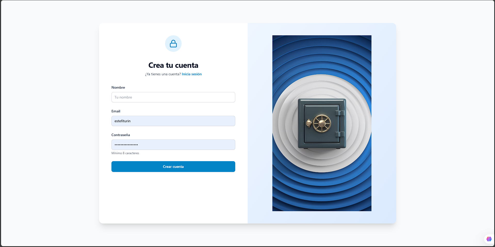
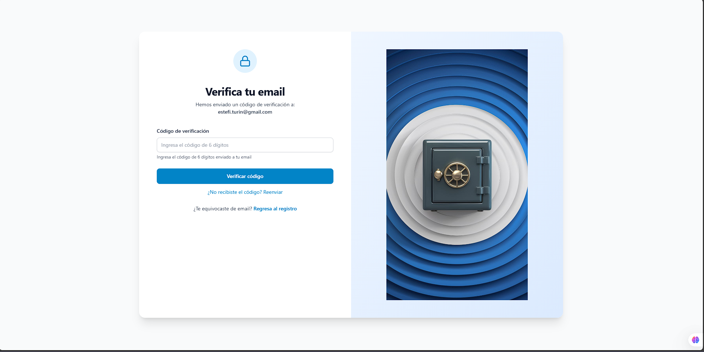
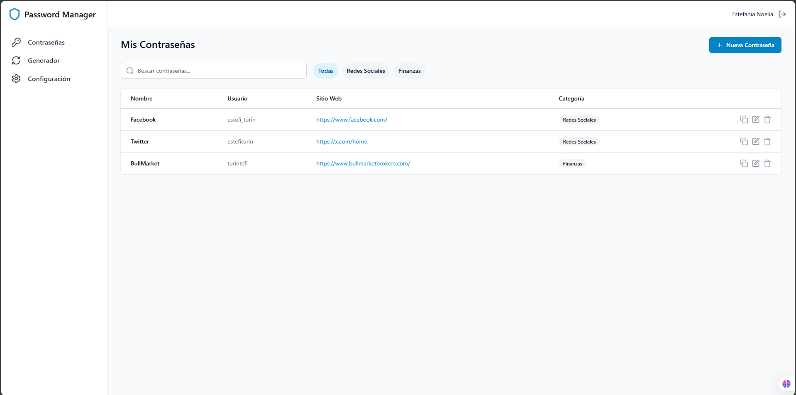
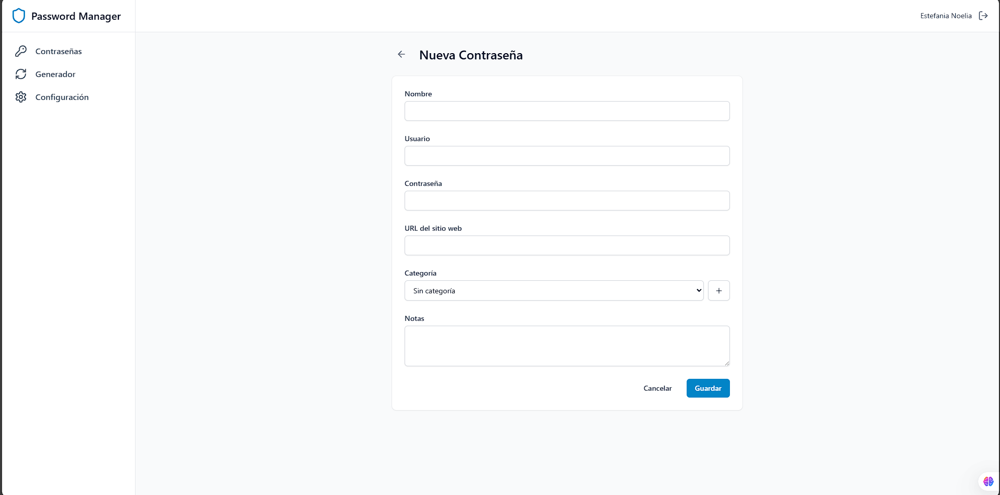
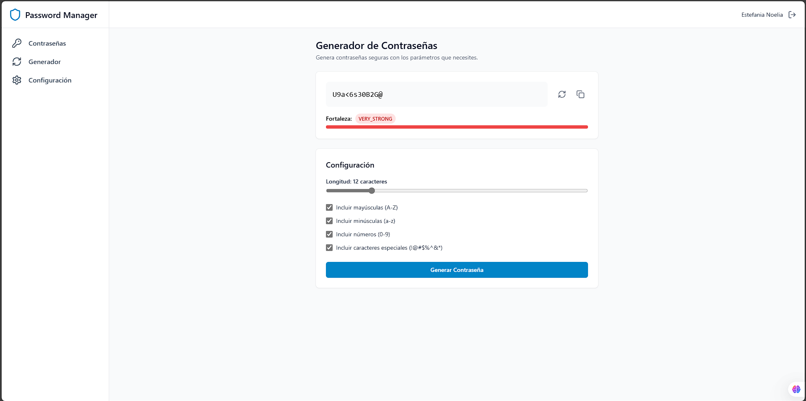
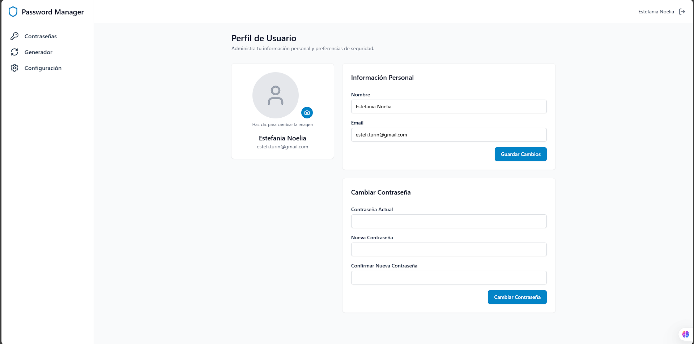

# Interfaz de Usuario - Password Manager

## 🔐 Autenticación y Registro

### Registro de Usuario

- Formulario de registro con validación en tiempo real
- Campos: nombre, email y contraseña
- Integración con sistema de verificación por email

### Verificación de Email

- Pantalla de ingreso de código de verificación
- Opción para reenvío de código
- Feedback instantáneo de validación

### Login

- Interfaz de inicio de sesión
- Acceso seguro con JWT
- Enlace a recuperación de contraseña

## 📝 Gestión de Contraseñas

### Dashboard Principal

- Vista general de todas las contraseñas almacenadas
- Sistema de búsqueda y filtrado
- Organización por categorías
- Acciones rápidas: copiar, editar, eliminar

### Nueva Contraseña

- Formulario completo para nueva entrada
- Selector de categorías con opción de crear nueva
- Generador de contraseñas integrado
- Campo de notas y URL opcional

### Edición de Contraseña
- Interfaz de edición con datos precargados
- Validación de cambios

### Generador de Contraseñas

- Configuración personalizable de parámetros
- Indicador de fortaleza
- Vista previa de contraseña generada
- Botón de copiado rápido

## 👤 Perfil de Usuario

### Visualización de Perfil y Edición de Perfil

- Información del usuario
- Estadísticas de uso
- Imagen de perfil personalizable
- Actualización de datos personales
- Gestión de imagen de perfil
- Cambio de contraseña

## 🏷️ Gestión de Categorías

### Categorías
- Lista de categorías personalizadas
- Creación y edición de categorías
- Visualización de contraseñas por categoría

